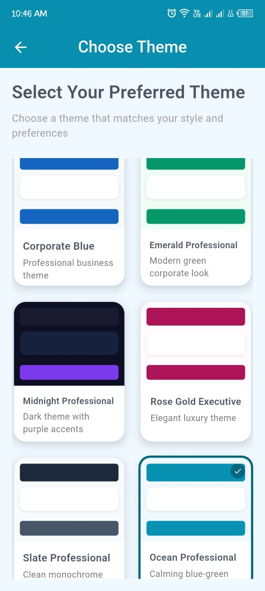
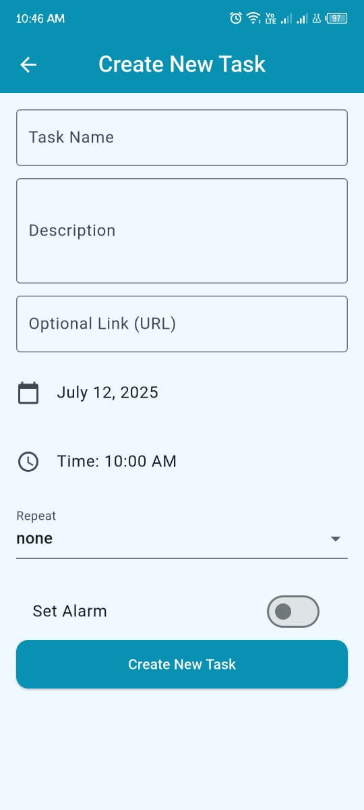

# 📝 Task Notifier - Smart Reminder App

**Task Notifier** is a minimal yet powerful Android app that helps you remember tasks at the exact time you set — even if the app is killed or your device restarts.

> Built using **Flutter** and **native Android (Kotlin)** for bulletproof background notifications and beautiful custom themes.

---

## 🚀 Features

- ⏰ **Set precise reminders** (even when the app is killed)
- 📛 **Auto-alarm triggers** even after device reboot
- 🔔 **Persistent notification + alarm bell** if task is ignored
- 🎨 **10+ Professional UI Themes**
- 🗕️ Repeatable tasks (daily, weekly, monthly)
- 🔕 Handles battery optimizations, autostart, and background execution
- 📲 Works on all major Android OEMs (Infinix, Xiaomi, Vivo, Oppo, etc.)

---

## 🖼️ App Screenshots

| Home | Theme Picker | Task Reminder |
| ---- | ------------ | ------------- |
|  |  |  |

> Add your screenshots inside the `/screenshots` folder and update filenames above.

---

## 📆 Download APK

> ✅ [Download Latest APK (Google Drive)](https://drive.google.com/file/d/1-Z35oky7jzbiUZXRqcuGqAqc_iZ3QXjc/view?usp=sharing)

📂 Or check `build/app/outputs/flutter-apk/app-release.apk` after building locally.

---

## ⚙️ Permissions Used

| Permission                         | Reason                                            |
| ---------------------------------- | ------------------------------------------------- |
| `SCHEDULE_EXACT_ALARM`             | For precise task alarms                           |
| `FOREGROUND_SERVICE`               | To ensure notifications run even if app is killed |
| `RECEIVE_BOOT_COMPLETED`           | To re-register alarms after device reboot         |
| `IGNORE_BATTERY_OPTIMIZATIONS`     | To bypass Doze mode and ensure reliability        |
| `POST_NOTIFICATIONS`               | To show notifications on Android 13+              |
| `SYSTEM_ALERT_WINDOW` *(optional)* | For persistent reminders if added later           |

---

## 🔧 Built With

- [Flutter](https://flutter.dev/)
- Native Kotlin Services & AlarmManager
- Shared Preferences
- Provider for theme management

---

## 🛠️ How to Build Locally

```bash
git clone https://github.com/waleed719/tasknotifier.git
cd task-notifier
flutter pub get
flutter build apk --release
```

---

## 🧠 TODO (Future Enhancements)

- 🔁 Snooze & dismiss buttons
- 🧠 Smart suggestions for task time
- 🗖️ Calendar view
- ☁️ Firebase sync

---

## 🙌 Special Thanks

- Flutter & Android community
- Infinix, Xiaomi & Vivo users for testing

---

## 📬 Contact

For issues, feel free to open an [Issue](https://github.com/waleed719/tasknotifier.git/issues) or message me on [LinkedIn](www.linkedin.com/in/waleed-qamar-84a6201bb).

---

### ⭐ Don’t forget to Star the repo if you like it!

